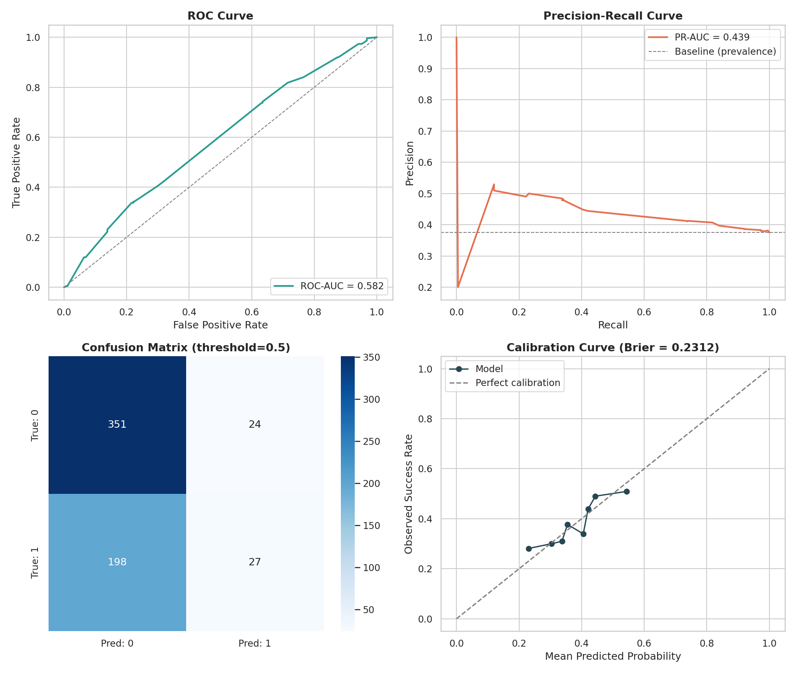
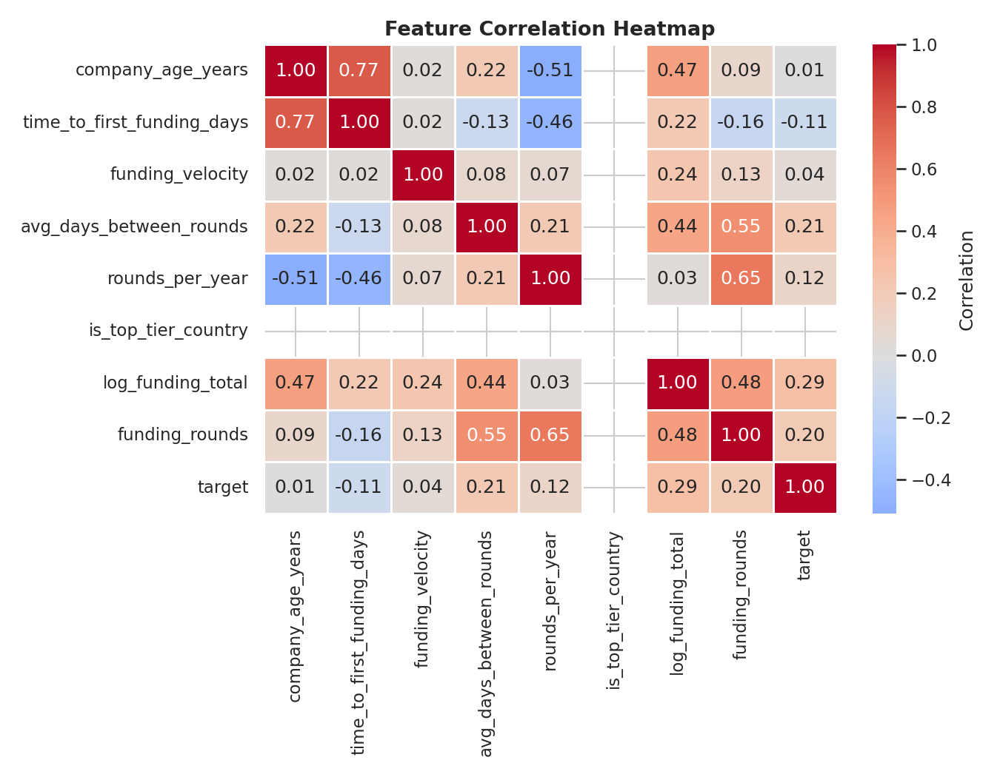
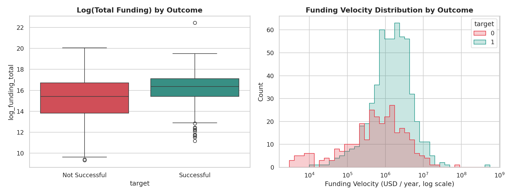
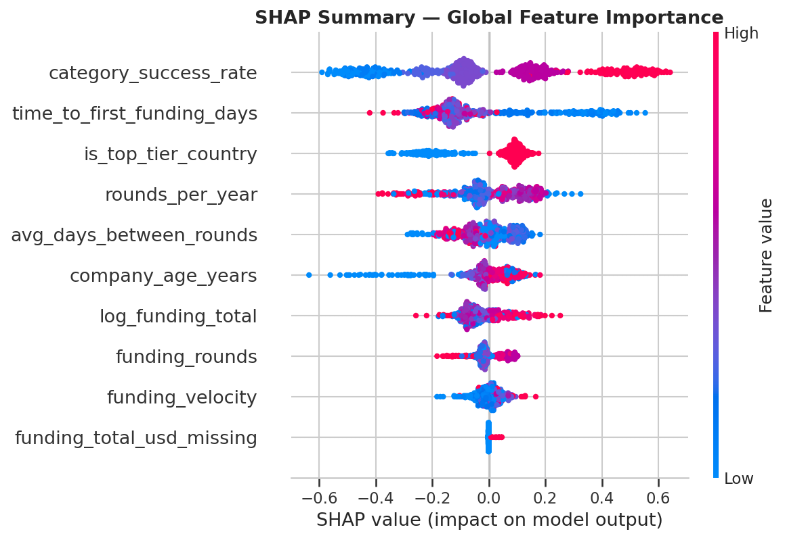
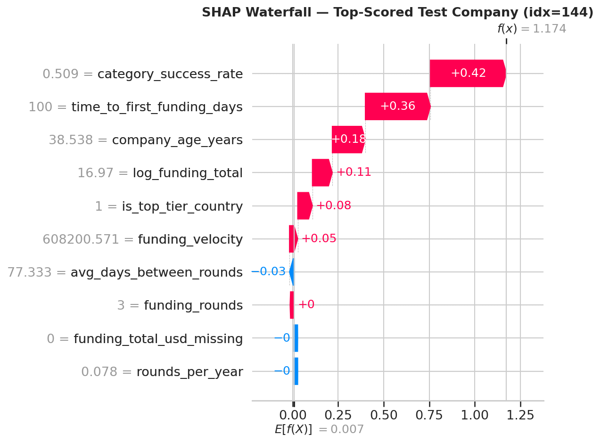

# Startup Success Prediction Using Machine Learning

An end-to-end, explainable ML pipeline that estimates a startup's probability
of success (acquisition/IPO vs. shutdown) from funding and company metadata —
built to mirror how VC firms do ML-assisted deal screening.

> **Disclaimer:** Startup outcomes are noisy and shaped by unobservable
> factors. This is a decision-**support** tool for screening/triage, not a
> substitute for full investment diligence.

## What's inside
- `PROJECT_DOCUMENTATION.md` — full project spec: architecture, data sources,
  feature engineering, models, metrics, and upgrade ideas.
- `startup_success_prediction.py` — complete pipeline, structured as
  Colab-ready cells (`# CELL N`). Runs standalone out of the box using a
  built-in synthetic dataset generator; swap in a real Kaggle/Crunchbase CSV
  for production results.
- `requirements.txt` — pinned dependency list.

## Quickstart
```bash
pip install -r requirements.txt
python startup_success_prediction.py
```
Or paste each `# CELL N` block into its own Google Colab cell and run top to
bottom.

To use real data, place a Kaggle "Startup Success Prediction" (or similar
Crunchbase-derived) CSV at `startup-success-prediction/data/raw/startup_data.csv`
with these columns: `name, category, country, founded_at, first_funding_at,
last_funding_at, funding_total_usd, funding_rounds, status`.

## Pipeline
Data ingestion → cleaning → leak-safe feature engineering → Logistic
Regression baseline → XGBoost / LightGBM (randomized hyperparameter search,
imbalance-aware) → probability calibration → ROC / PR / calibration
evaluation → SHAP global & local explainability → interactive scorecard →
serialized model artifact + `predict_startup_success()` inference function.

## Sample Results
*(from the built-in synthetic demo dataset — real Crunchbase data will differ)*

| Metric | Score |
|---|---|
| ROC-AUC | 0.582 |
| PR-AUC | 0.439 |
| F1 | 0.196 |
| Brier Score | 0.231 |
| Precision@50 | 52% (vs. 37.5% base rate) |

### Evaluation Dashboard


### Feature Correlations


### Funding Distributions by Outcome


### SHAP Global Feature Importance


### SHAP Local Explanation (single company)


## License
MIT — see `LICENSE`.
